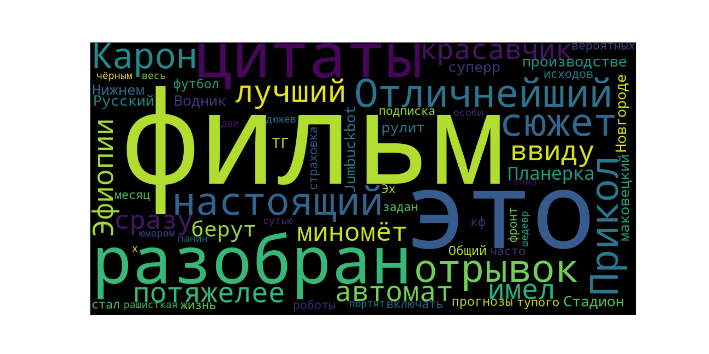
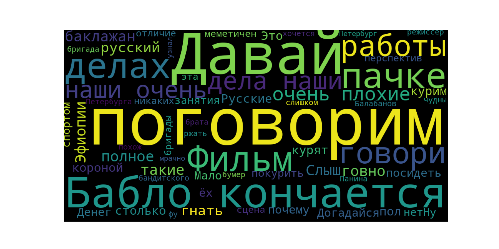
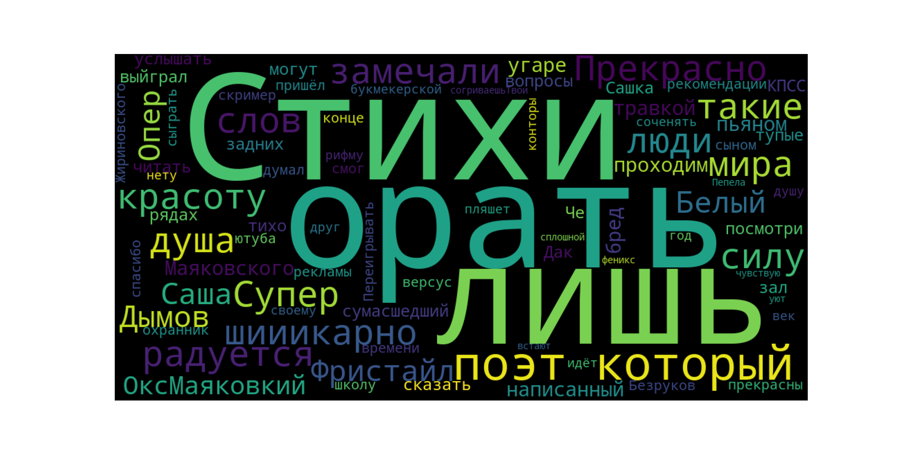
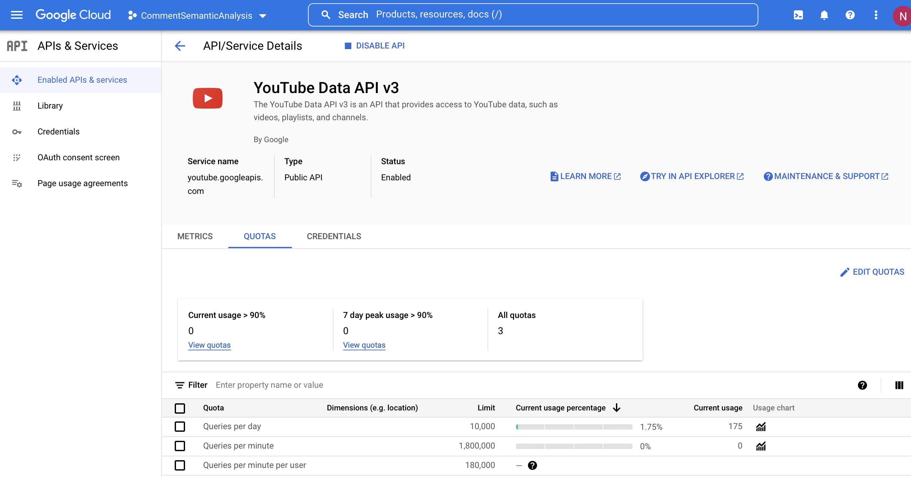

# Анализитор комментариев с видео YouTube

Схема  работы:

1.  Загружается  ссылка  на  видео
2.  Сервис  получает  комментарии
3.  Выделяет  их  в  классы «положительные» и «негативные»
4.  Строит  облако  слов
5.  Считает  частоту  появления  слов  в  каждом  классе

# Примеры

Источник - [**отрывок из фильма "Жмурки"**](https://youtu.be/lYWx3WK8oO8)

Источник - [**отрывок из сериала "Есенин"**](https://youtu.be/FLTItzgBE3k)

# Как работает сервис?

1. Получение  комментариев  под  видео  через YouTube API

2. Получение  тона  комментария  через  нейронную  сеть  с  использованием Bert

3. Генерация  облака  слов  и  получение  частоты  слов  в  комментариях

## YouTube API

Все  запросы  идут  через  официальный  токен Google. Существуют  ограничения  в 10000 запросов  в  день, если  комментариев  под  видео  слишком  много, то  тратится  запрос  за  комментарий, поэтому  в  сервисе  считываются  только  первые 2 страницы  комментариев (примерно 40 комментариев)

## Анализ тональности комментариев

Нейронная  сеть  для  определения  тональности  комментария  была  обучена  на 20 тыс. русскоязычных  комментариев  пользователей  с Twitter. Такой  выбор  был  сделан  с  учетом  лексики, синтаксиса, размеров  комментариев  сходных  с  комментариями  с YouTube и  ввиду  отсутствия  размеченных  данных  комментариев  с YouTube.

Сеть была обучена с использованием Bert с предобученной моделью DeepPavlov/rubert-based-cased на Google Colab

## Генерация данных

1.  Облако  слов - генерируется  с  помощью  библиотеки Python - WordCloud
2.  Частота  слов - генерируется  подсчётом  слов  с  исключением  стоп-слов. Список  стоп-слов  использовался  из  библиотеки nltk, но  из-за  своей  бедности  был  дополнен  вручную  через  текстовый  файл stop_words_addition.txt

# Перспективы

1.  Использовать  методы  для  исправления  орфографии  комментария (такие  как  встроенные  в  библиотеку TextBlob) - нейронной  сети (точнее  токенайзеру Bert) будет  легче  распознавать  слова  и  выделять  тональность
2.  Сделать  веб-интерфейс - сервис  сделан  с  расчётом  на Web API и  сделана  часть backend на FastAPI
3.  Более  глубокую  аналитику  по  словам  и  их  частоте
